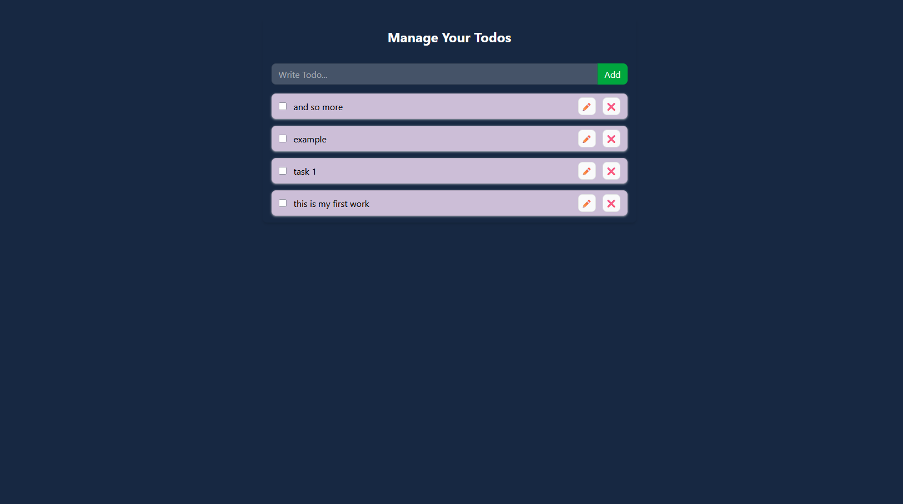

# 📝 React Todo App with LocalStorage & Context API

A simple yet powerful Todo App built with **React.js**, using **Context API** for state management and **LocalStorage** for persistent data.

## 🚀 Live Preview 👉 [View Live](https://todo-with-context-api-kappa.vercel.app/)

## 🚀 Features

* ✅ Add new todos
* ✏️ Edit/update existing todos
* ❌ Delete todos
* 🔁 Toggle completion status
* 📂 Persist todos using `localStorage`
* 📆 Clean folder structure with reusable components

---

## 📁 Folder Structure

```
src/
│
├── components/
│   ├── TodoForm.js         # Form to add/update todos
│   └── TodoItem.js         # Individual todo item UI
│
├── contexts/
│   └── index.js            # Context provider for global state
│
├── App.js                  # Main app with logic and layout
└── App.css                 # Basic styling
```

---

## 🧐 What You Learn From This Project

✅ React functional components
✅ `useState` and `useEffect` hooks
✅ Creating and using **Context API**
✅ State updates with immutability
✅ LocalStorage integration for persistent state
✅ Managing lists (add, update, delete, toggle)
✅ JSX and component reusability
✅ TailwindCSS utility classes for styling
✅ Clean code organization & separation of concerns

---

## 🛠️ Technologies Used

* ⚛️ React.js
* 🎨 Tailwind CSS
* 🌐 LocalStorage
* 💡 Context API

---

## 🧑‍💻 Getting Started

### 1. Clone the repo

```bash
git clone https://github.com/your-username/react-todo-app.git
cd react-todo-app
```

### 2. Install dependencies

```bash
npm install
```

### 3. Start the development server

```bash
npm start
```

The app will be live at `http://localhost:3000`

---


## ✨ Future Improvements

* Add filtering (All / Completed / Pending)
* Add due dates and reminders
* Integrate with Firebase or a backend
* Drag-and-drop reordering

---

# Screenshot



## 🙌 Acknowledgements

* Built using **React** with ❤️
